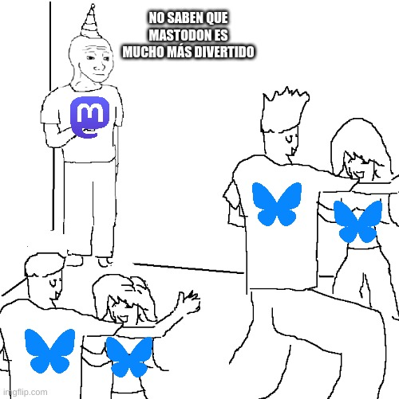

Title: La escasa épica de mi abandono de Twitter
Category: Blog
Lang: es
Tags: opinion
Slug: abandono-twitter
Authors: Pablo Rodríguez-Sánchez
Summary: He abandonado Twitter, aunque sin cambiar el mundo.
Comments: True
Translation: False

Hace tiempo que [mi cuenta de Twitter](http://twitter.com/DonMostrenco) apenas tenía actividad.
Empecé eliminando el acceso directo en mi teléfono móvil.
Después, desinstalando la app.
Finalmente, hoy he solicitado el archivo de mis datos.

Más o menos desde entonces, empecé a estar más activo en mis cuentas de [Bluesky](https://bsky.app/profile/pabrod.bsky.social) y [Mastodon](https://paquita.masto.host/@DonMostrenco).

Mi única queja, hasta el momento, era que en ambas redes había poca actividad.
Sin embargo, muy recientemente, Bluesky ha recibido una avalancha de usuarios.
Siguiendo la estela the [The Guardian](https://www.theguardian.com/media/2024/nov/13/the-guardian-no-longer-post-on-x-twitter-elon-musk), se ha producido un éxodo masivo de X, antes Twitter.

Durante este fin de semana, me han llegado más de 1000 seguidores nuevos, y el ambiente en Bluesky es cada vez más agradable.

Pero volvamos al principio.

## ¿Por qué abandoné Twitter?
Como usuario de redes sociales, mis aspiraciones son más bien sencillas.
De mis textos, no espero más que disfrutar escribiéndolos, que no es poco.
Que haya personas que los encuentren interesantes, por el motivo que sea, es una sorpresa muy bienvenida.

Como carambola, a algunas personas resulta que les gustan mis textos.
Algunas incluso se han convertido en amigas mías.
Que algunos de mis textos me hayan abierto puertas profesionales me parece simplemente increíble.

En resumen, escribir en redes sociales es una parte significativa de mi vida social.El Twitter de los últimos años se había convertido en un lugar tóxico, sí, pero ante todo **inútil**.
Sus oscuros algoritmos me estaban sirviendo bazofia no solicitada, y el alcance de mis tuits no llegaba.
Ya no me servía para conectar con gente interesante.

Twitter me aburría.
Y en mi personal e intransferible escala de valores, eso es peor que una bofetada.
Así que, adiós.

## Una historia poco épica
Habrán ustedes notado, queridos lectores, que mi abandono de Twitter no obedece a elevadas disquisiciones filosófico-políticas.
Ni siquiera he utilizado la palabra fascismo.
Quizás me equivoque, pero sospecho que la ausencia de mi cuenta de Twitter en _"la batalla cultural"_ no es el principal obstáculo a la paz mundial.
Es posible que, ahora que no estoy activo allí, el usuario _@waffenSS88_ haya perdido su última oportunidad de leerme, ver la luz, y descubrir que apalear extranjeros es éticamente reprobable.
Pero correré el riesgo.

Además, mis tuits nunca pretendieron proponer sistemas de pensamiento completos y sin fisuras en 140 caracteres.
Yo era más de chascarrillos y de enlaces a curiosidades.
Nunca hice temblar a un gobierno (probablemente usted tampoco).
Para cosas medianamente serias prefiero usar este blog.
Raro que es uno.
Quizás nunca entendí esa red.

Lo repito, me he ido porque me aburría.
Y por motivos prácticos aún más prosaicos, como que las publicaciones sean de acceso libre o que se puedan seguir por RSS.

## Mastodon, mi querido Mastodon
A muchos de nosotros nos hubiese gustado que el éxodo hubiera tenido a Mastodon como destino.
Sigo pensando que esa red tiene un potencial brutal.
Por lo pronto ya me ha proporcionado [alguna alegría]({filename}2024-10-30%20documentos-rne.md).

Pero nos hemos tenido que conformar con Bluesky.
El pueblo ha hablado.
Y francamente, no me parece mala opción del todo.

Que sí, que ya sé que Bluesky no es una red cooperativa.
Que detrás hay un negocio cuyos inversores no son precisamente unos adorables cachorritos de _Golden retriever_.
Pero tiene buen rollo, RSS y, al fin, una masa crítica de usuarios.
Vaya, que **funciona**.
Disfrutémoslo mientras dure.
Y no olvidemos lo fácil que fue cambiarse... por si vuelve a tocar hacerlo.

Y ante todo, no caigamos en volvernos unos cenizos.
Lo que es a mí, me veréis en ambas redes, [aquí](https://bsky.app/profile/pabrod.bsky.social) y [aquí](https://paquita.masto.host/@DonMostrenco).

*Lo siento, tenía que hacerlo*

Nos leemos.
En unas redes cada vez más limpias.
Espero.
