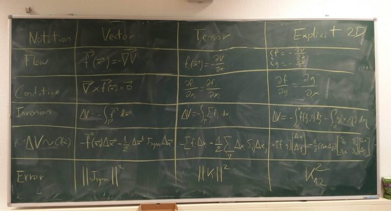
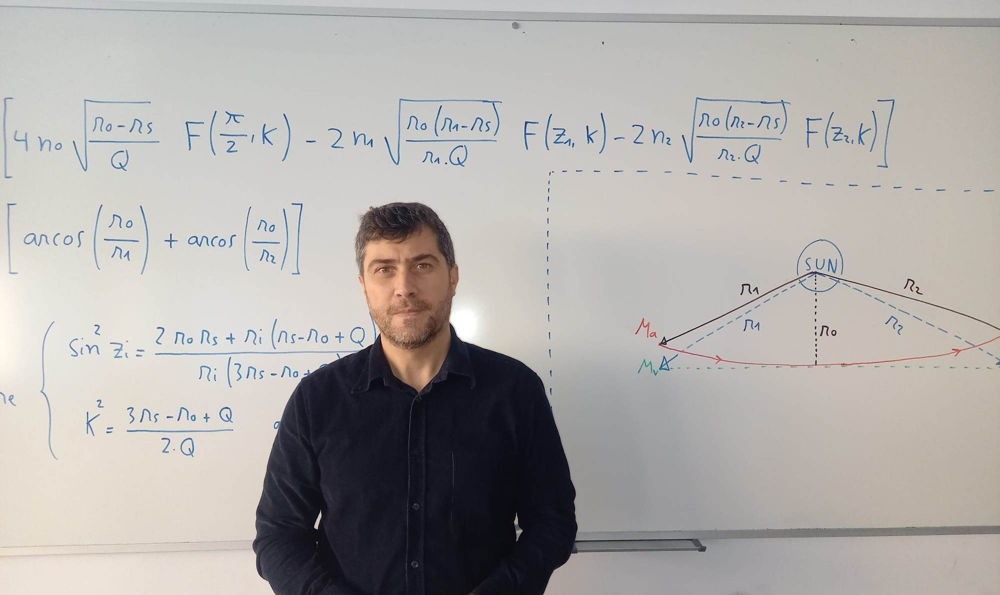
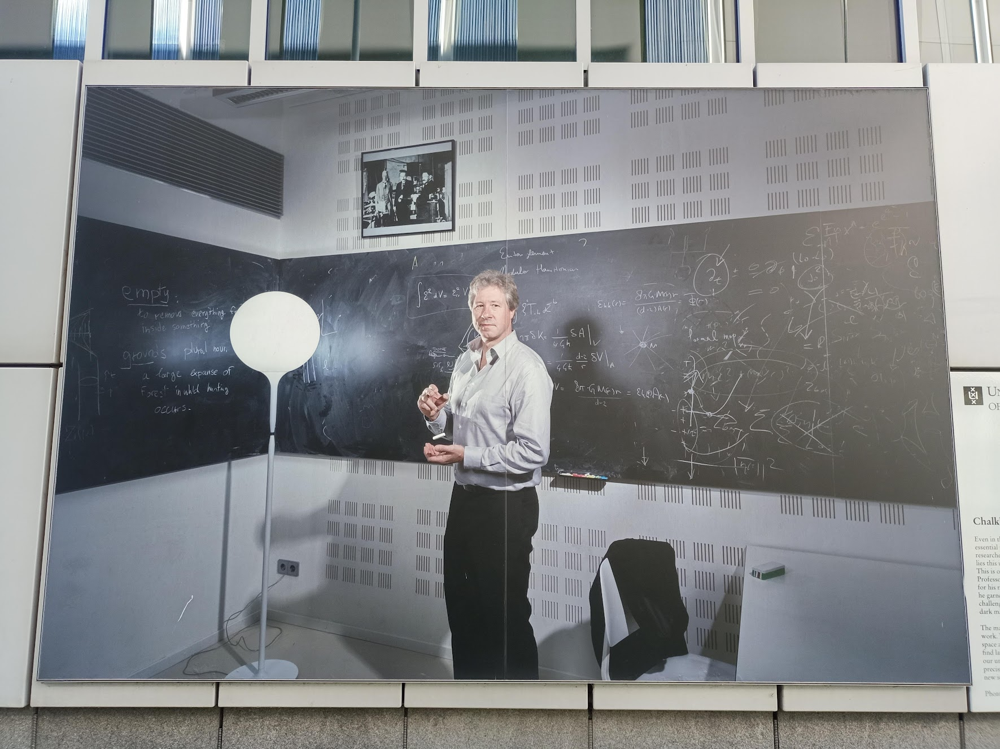

Title: Lo que delata una pizarra
Category: Blog
Lang: es
Tags: opinion
Slug: pizarra
Authors: Pablo Rodríguez-Sánchez
Summary: La pizarra es una ventana a tu cerebro. Úsala con cariño.
Comments: True
Translation: False

## Claridad y precisión
Decía el matemático Steven Strogatz que uno de los mejores indicadores del rendimiento futuro de un alumno es la claridad de sus apuntes (cito de memoria).

Yo no soy Strogatz, pero hace ya muchos años que presto mucha atención a las estrategias expositivas, el formato e incluso la estética de las comunicaciones científicas.
Es una afición dolorosa, pues **las publicaciones científicas son notorias por la baja calidad de su prosa**.

Muchos achacan esta falta de claridad a la necesidad de utilizar un lenguaje extremadamente preciso.
Aunque hay algo de cierto en esto, no puedo estar de acuerdo.
He visto en demasiadas ocasiones como **la necesidad de precisión se desvanece completamente a la hora de proporcionar el código fuente o, incluso, las ecuaciones utilizadas** para sostener las conclusiones de un artículo.
También he conocido autores que abogan abiertamente por una prosa deliberadamente oscura con el objetivo desquiciado de _"no ponérselo demasiado fácil al lector"_ (!).
Ustedes me dirán qué tiene que ver esto con la precisión del lenguaje.

Precisamente en las ecuaciones se nota mucho el esfuerzo que ha puesto el autor o autora en explicarse con claridad.
Y es que las ecuaciones tienen una flexibilidad enorme a la hora de ser escritas.
Por ejemplo, las ecuaciones contienen variables.
Las variables son como cajas que pueden contener cualquier cosa, de modo que el nombre de la caja es lo de menos: tenemos total libertad para llamarlas $x$ o $Alberto$.
Esta libertad las convierte en un ejemplo excelente de cuestiones de estilo en comunicación científica.

Por ejemplo, podemos usar siempre mayúsculas para los estados de un sistema, y reservar las minúsculas para las constantes.
Quién dice mayúsculas y minúsculas dice letras latinas y griegas.
También podemos usar subíndices para representar estados relacionados, o crear una notación más compacta convirtiéndolos en un vector.
Otro interesante ejemplo es el de cómo diferentes notaciones para las derivadas pueden simplificar (o complicar) el aprendizaje de las mismas, como conté [aquí](https://fuga.naukas.com/2016/03/10/derivadas-con-primas-o-diferenciales/).

En cuánto a lo de ser críptico a propósito, creo que es un error enorme.
No sólo estás poniéndole la vida más difícil a tus posibles lectores, sino que además **invitas a pensar que tus pensamientos son tan desorganizados y crípticos como tus textos**.
Vamos, que además quedas como un patán.

## Historias de pizarras
Si puedo elegir, prefiero no quedar como un patán.
Así que cuando escribo mis publicaciones procuro ponerle mucho mimo al tema de la claridad.

Véase por ejemplo la imagen de abajo.
Ahí muestro los tres tipos de notaciones diferentes que evalué utilizar en uno de [mis artículos](https://journals.plos.org/ploscompbiol/article?id=10.1371/journal.pcbi.1007788).
Le presenté esta pizarra a varios compañeros, ajenos a mi investigación y procedentes de disciplinas diferentes, para decidir cuál de ellas les resultaba más clara.
Escribí sobre ello en [Un doctorado en cinco pizarras](https://fuga.naukas.com/2021/03/03/un-doctorado-en-cinco-pizarras/).

### Pizarras bien
El otro día me topé en LinkedIn con algo inusual en esa red: una foto que me gustó de veras.
Era esta (más información [aquí](https://www.um.es/web/sala-prensa/-/el-profesor-%C3%B3scar-del-barco-desarrolla-una-nueva-ecuaci%C3%B3n-que-permitir%C3%A1-localizar-con-mayor-precisi%C3%B3n-astros-en-el-universo?utm_source=acortador&utm_medium=referral&utm_campaign=acortador_url&utm_id=ecuacion-oscarbarco)):

Fuente [aquí](https://www.um.es/web/sala-prensa/-/el-profesor-%C3%B3scar-del-barco-desarrolla-una-nueva-ecuaci%C3%B3n-que-permitir%C3%A1-localizar-con-mayor-precisi%C3%B3n-astros-en-el-universo).

Me llamó enormemente la atención la claridad de lo escrito en esa pizarra.
No me refiero tan sólo a la ortografía, sino más bien al conjunto:
los renglones rectos y el espacio entre ecuaciones dejan claro el orden de lectura,
el uso de llaves une visualmente conceptos relacionados,
el diagrama define las variables más importantes,
y al estar aislado en un recuadro queda claro que es un material de referencia independiente del orden de lectura.

El autor ha utilizado esa pizarra para desarrollar y exponer una idea de por sí compleja... sin embarullarla aún más.

Esa pizarra es reflejo y **prueba fehaciente de la estructuración mental del autor**.
Una buena carta de presentación para cualquier científico.

### Pizarras mal
Por motivos de trabajo, paso muy a menudo por el campus de ciencias de la universidad de Ámsterdam.
En su exterior lucen con orgullo varias fotografías de residentes ilustres, tamaño mural.
Una de ellas[^1] me llama especialmente la atención.
Es esta:

Foto del propio autor.

Antes de seguir leyendo, te recomiendo que maximices la imagen y prestes atención a la pizarra y trates de adivinar qué es lo que me llama la atención aquí.

¿Lo has hecho?, pues sigamos.

No sé qué te habrá parecido, pero a mí esta pizarra me pone los pelos de punta.

Al contrario que en el ejemplo anterior, esta pizarra evoca todo menos claridad.
Todos los elementos están desconectados entre sí.
Muchos ni siquiera tienen sentido por sí solos.
El creciente embarullado según desplazamos la vista de izquierda a derecha invita a pensar, más que en la progresión de una narrativa, en la progresión de una crisis psicótica.

Lo sé, lo sé, tan sólo es una foto.
No sería raro que el fotógrafo haya pedido al autor que escribiese cualquier cosa deprisa y corriendo.
Pero es que la pizarra ocupa un lugar central en la historia que quiere contar la fotografía (nótese la tiza flotando entre las manos).
Si la pizarra anterior era prueba de la estructuración mental del autor, esta, en el mejor de los casos, no prueba nada.

¡Lástima de oportunidad perdida!

## Coda
Si quieres cabrearme, no borres la pizarra al acabar.

Si quieres cabrearme de veras, enfádate porque te la han borrado.

[^1]: correspondiente a un prestigioso investigador cuyo nombre no mencionaré por no meter el dedo en la llaga.