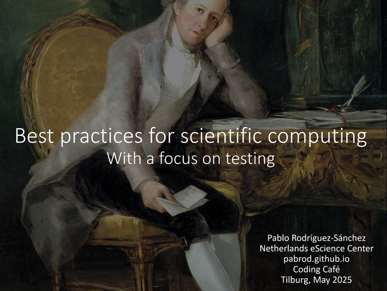

Title: Talk announcement: Coding Café Tilburg
Category: Blog
Lang: en
Tags: announcement
Slug: coding-cafe
Authors: Pablo Rodríguez-Sánchez
Summary: On best programming practices for researchers, and why they matter.
Comments: False
Translation: False

---

## Title
Best practices for scientific programming, with a focus in testing

[][link to slides]

## Abstract
Software projects, big or small, have a lot of complexity.
Not only they perform complex tasks, but often they have thousands of lines and multiple authors.
To make things even more complicated, software projects are rarely static, but keep evolving in time.
How is all this complexity managed?
The answer is: by using best practices.

Chances are you've heard about best practices for researchers.
But did you know their primary purpose is to make **your** life easier?
Furthermore, did you know they are rooted at the very core of the scientific method?

We'll talk about these and other topics, and will focus our attention on a particularly useful practice: unit testing.

Join us if you want to know more.
And bring your laptop!
We'll cover the mechanics of **unit testing in both R and Python**.

And last but not least, there will be pizza! 🍕

## Slides
The slides of this talk are temporarily available [here][link to slides].

## Spacetime coordinates
- [Registration link](https://tilburguniversity.libcal.com/event/4367167) (only for members of Tilburg University)
- May 22nd 2025
- 11:00 - 13:00
- Tilburg University. [Simon building](https://www.tilburguniversity.edu/contact/campus-map-and-buildings/simon "https://www.tilburguniversity.edu/contact/campus-map-and-buildings/simon") , room S8 (ground floor)

---

> ## Requirements
> To get the most out of this talk, we encourage you to bring a laptop. Please make sure you have installed and updated at least one of these:
>
> ### For R users
> - R
>    - With the `testthat` and `usethis` CRAN packages
> - R studio (recommended)
>
> ### For Python users
> - Python
>    - With the [`pytest`](https://docs.pytest.org/en/stable/getting-started.html) package
>- An environment manager such as conda or poetry (recommended)

---

## Materials and references
### Slides
The slides of this talk are temporarily available [here][link to slides].

### Testing with Python
- [Writing functions in Python](http://swcarpentry.github.io/python-novice-gapminder/16-writing-functions/index.html)
- [Tests in Python](https://docs.pytest.org/en/6.2.x/)

### Testing with R
- [Writing functions in R](http://swcarpentry.github.io/r-novice-gapminder/10-functions/index.html)
- [Tests in R](https://testthat.r-lib.org/)

### Extended best practices
- [Best Practices for Scientific Computing](http://dx.plos.org/10.1371/journal.pbio.1001745)
- [Good enough Practices in Scientific Computing](https://journals.plos.org/ploscompbiol/article?id=10.1371/journal.pcbi.1005510)
- [Effective computation in physics](https://www.oreilly.com/library/view/effective-computation-in/9781491901564/)

[link to slides]: https://nlesc-my.sharepoint.com/:p:/g/personal/p_rodriguez-sanchez_esciencecenter_nl/EXFfK7waaZdPpCWxo6z96XoBzdnRQGGpNBiTRt050pcGyQ?e=0fAezv