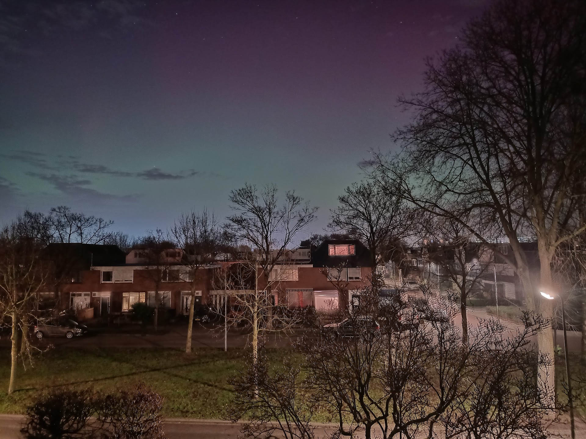

Title: Aurora boreal
Category: Blog
Lang: es
Tags: opinion
Slug: aurora-boreal
Authors: Pablo Rodríguez-Sánchez
Summary: Mi primera aurora boreal
Comments: True
Translation: False

Hace unos días, el 19 de Enero de 2026, vi mi primera [aurora boreal](https://nos.nl/artikel/2598905-noorderlicht-op-veel-plekken-in-nederland-te-zien). Y ni siquiera tuve que salir de mi casa. Alguien me avisó de que las estaban viendo desde Zwolle, tan sólo a 100 km al norte de donde vivo, así que corrí a la ventana... y allí estaba.

El 99% del tiempo no era más que un tenue resplandor verdoso, a ratos rojizo, en el horizonte en dirección norte. Aunque quedaban espectaculares en las fotos, con el ojo desnudo eran casi invisibles.

Algunas veces, eso sí, se vieron olas verdes muy intensas en nuestro cénit. Colgando como una inmensa cortina. Más que moverse aparecían y desaparecían.

Me acordé de una historia que contaba mi abuela. Trataba de una aurora que vio desde Guadalajara. Fue el 25 de Enero de 1938, en plena guerra civil española. No era un recuerdo feliz: muchos vieron en esas luces en el cielo una amenaza, probablemente gas lanzado por los alemanes. El recuerdo de la primera guerra mundial, aún llamada Gran Guerra, aún estaba fresco. 

Ayer, al menos, nadie se asustó. Al contrario, hubo fascinación generalizada. El mundo está peor que hace unos años, sí, pero no tan mal como en 1938.