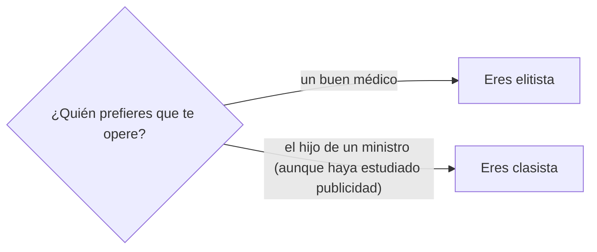

Title: Sobre clasismo y elitismo
Category: Blog
Lang: es
Tags: opinion
Slug: clasismo-y-elitismo
Authors: Pablo Rodríguez-Sánchez
Summary: Clasismo y elitismo. Que no, que no es lo mismo.
Comments: True
Translation: False
Cover: images/clas.png

Dejo aquí un breve apunte, porque veo mucha confusión entre estos dos conceptos en mis redes sociales.

Imagina que tienen que operarte. Si prefieres que te opere:

- un buen médico, eres elitista.
- el hijo de un ministro (aunque haya estudiado publicidad), eres clasista.

Lo dejo también en forma de diagrama:

Que sí, que ya sé que las cosas son más complicadas que esto.
Que es indudable que el ascensor social está averiado.
Pero por difícil que sea llegar a convertirse en médico, más difícil es convertirse en hijo de un ministro.

No negaré que hay una correlación entre ambas cosas. 
Pero esto de insistir en que los hijos de los ricos lo tienen más fácil para formarse (cosa cierta) se parece peligrosamente a la idea, esta sí profundamente clasista, de que el hijo del señorito además de más rico es más listo. Y no.

De hecho, eso de tener que adquirir habilidades siempre ha sido una cosa muy de pobres. Que se lo pregunten (en inglés) a Feijóo.
