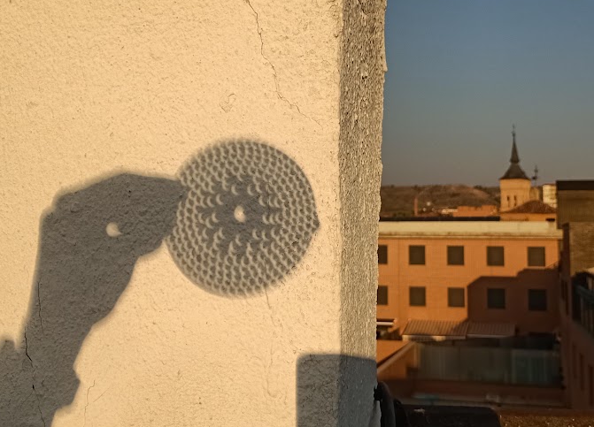

Title: 8 cosas que aprendí de un eclipse total
Category: Blog
Lang: es
Tags: opinion
Slug: eclipse26
Authors: Pablo Rodríguez-Sánchez
Summary: Curiosidades alrededor del eclipse total de sol de Agosto de 2026
Comments: True
Translation: False
Cover: images/2026/eclipse26.png

Hace unos días hubo un eclipse total visible desde la mayor parte de España.
La ruta de la totalidad incluyó mi Guadalajara natal, y no quise perderme la oportunidad.

No voy a aburrirles con fotografías, ni con torpes intentos de describir lo impresionante del evento.
Todo lo contrario.
Voy a dejar aquí una lista de cosas que me sorprendieron de veras, y que me hubiera gustado que alguien me hubiese contado antes.

1. Mucha gente no sabe lo que es un eclipse. Ni la diferencia entre un eclipse solar y uno lunar. Asimismo, mucha gente confunde un eclipse parcial con uno total. Y eso que es uno de los fenómenos astronómicos más sencillos de entender: _"la Luna se ha puesto en medio"_.
1. Los medios agitaron tanto las medidas de precaución para no quemarse los ojos, que no pocos entendieron que el día del eclipse el sol sería mucho más peligroso que cualquier otro día de Agosto. Algunos, incluso, llegaron a encerrarse en casa por miedo a quedarse ciegos. Una verdadera pena.
1. Hay quién cree, de veras, que los fenómenos astronómicos los organizan los gobernantes, las empresas o, en general, _"los poderosos"_. Hablo de gente normal, de nuestro entorno. No hablo del antiguo Egipto, sino de un país europeo en el siglo XXI. Debe de ser angustioso sentirse tan pequeño.
1. Mistificaciones como estas nos recuerdan que los tiempos en los que la humanidad pensaba que había un mundo sublunar, el nuestro, y un mundo supralunar, en el que regía una lógica diferente, no están tan alejados. Piensa por ejemplo en la expresión: _"la Luna se ve porque refleja la luz del Sol"_. Mírate la mano, ¿acaso dirías, levantando la ceja, que se ve porque refleja la luz del Sol?
1. Nunca había visto tantos turistas en Guadalajara como en el par de horas previas al eclipse.
1. La diferencia entre un eclipse total y uno parcial, incluso al 99%, es abismal. Es sorprendente la cantidad brutal de luz que emite el astro rey. Al 99%, todavía es de día.
1. La transición de luz a sombra fue menos súbita de lo que esperaba. Tenía la esperanza de ver venir una línea de sombra claramente definida, pero no fue eso lo que pasó. La transición se produjo con una suerte de arcoiris fundido a marrón. Bastante rápida, sí, pero no súbita ni con una frontera clara.
1. Al igual que las [auroras boreales](./aurora-boreal-es.html), un eclipse total es un fenómeno al que no le hacen justicia las fotos. Si puedes ver uno, hazlo.
