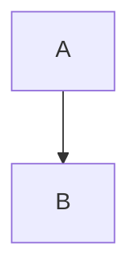

Title: Examples
Date: 4/22/2018
Modified: 1/10/2024
Tags: info
Slug: examples
Status: hidden
Authors: Pablo Rodríguez-Sánchez
Summary: Test ground for displaying complex stuff

## Code blocks

### Python
```python
def function(x):
    # code...
```


### R
```r
acceleration <- function(x, t, ...) {
    # ...
    return(ac)
}
```

---

## Math

Powered by [render-math](https://github.com/pelican-plugins/render-math) plugin!

### Inline
This is $\cos \theta$ math!

### Block

$$
e^{i\theta} = \cos \theta + i \sin \theta
$$

### Latex
\begin{equation} x^2 \end{equation}

---

## Mermaid diagrams

Powered by [markdown-mermaidjs](https://github.com/Lee-W/markdown-mermaidjs).

