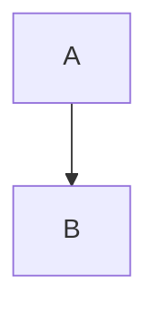

Title: Examples
Date: 4/22/2018
Modified: 1/10/2024
Tags: info
Slug: examples
Status: hidden
Authors: Pablo Rodríguez-Sánchez
Summary: Test ground for displaying complex stuff

## Code blocks

Code blocks seem to work out of the box.

### Python
```python
def function(x):
    # code...
```


### R
```r
acceleration <- function(x, t, ...) {
    # ...
    return(ac)
}
```

---

## Math

Powered by [render-math](https://github.com/pelican-plugins/render-math) plugin!

### Inline
This is $\cos \theta$ math!

### Block

$$
e^{i\theta} = \cos \theta + i \sin \theta
$$

### Latex
\begin{equation} 
    \sum_{i = 0}^\infty \frac{1}{n^2} = \frac{\pi^2}{6} 
\end{equation}

\begin{cases} 
    3x + 5y + z \\ 
    7x – 2y + 4z \\ 
    -6x + 3y + 2z 
\end{cases}

---

## Mermaid diagrams

Powered by [markdown-mermaidjs](https://github.com/Lee-W/markdown-mermaidjs).



Note that this requires adding a line to the default `MARKDOWN` configuration in `pelicanconf.py`.

```python
MARKDOWN = {
    'extension_configs': {
        'markdown.extensions.codehilite': {'css_class': 'highlight'},
        'markdown.extensions.extra': {},
        'markdown.extensions.meta': {},
        "markdown_mermaidjs": {}, # <------
    },
    'output_format': 'html5',
}
```

---

## Video

As explained [here](https://blog.markdowntools.com/posts/how-to-embed-a-video-in-markdown).

### Embedded
<iframe width="560" height="315" src="https://www.youtube.com/embed/tzxlw14Z8wU" frameborder="0" allow="accelerometer; autoplay; clipboard-write; encrypted-media; gyroscope; picture-in-picture" allowfullscreen></iframe>

### As link
[](https://www.youtube.com/watch?v=tzxlw14Z8wU)